<h1 align="center" style="margin: 30px 0 30px; font-weight: bold;">小鹿老师AI智能作业批改</h1>
<h4 align="center">基于 Vue 3 + TypeScript + Vite 开发的AI辅助教育平台前端</h4>
<p align="center">
	<a href="https://gitee.com/y_project/RuoYi"></a>
	<a href="https://gitee.com/y_project/RuoYi"></a>
	<a href="https://gitee.com/y_project/RuoYi/blob/master/LICENSE"></a>
</p>

## 项目简介

小鹿老师是一款面向K12教育的AI个性化平台，旨在通过AI技术辅助老师完成组卷和作业批改等教学任务。

平台核心功能包括：
- **AI智能组卷**：支持智能组卷、错题组卷、知识点组卷、分层组卷等多种组卷模式
- **AI作业批改**：自动批改学生作业，生成批改结果和详细报告
- **AI答案生成**：自动生成题目答案和解析
- **学情分析**：提供学生报告、班级报告、知识点掌握分析等多维度数据分析

## 前端技术栈
| 技术组件 | 说明 | 版本 |
| :--- | :--- | :--- |
| 核心框架 | Vue | 3.5.22 |
| 构建工具 | Vite (Rolldown) | 7.1.14 |
| UI 组件库 | Ant Design Vue | 4.2.6 |
| 开发语言 | TypeScript | 5.9.3 |
| 状态管理 | Vuex | 4.0.2 |
| 工具库 | VueUse | 14.0.0 |
| 国际化 | Vue I18n | 10.0.0 |
| 路由管理 | Vue Router | 4.6.3 |
| CSS 框架 | TailwindCSS | 4.1.16 |
| 图标库 | Iconify | 5.0.0 |
| 图表库 | ECharts | 6.0.0 |
| 图表库 | VChart | 2.0.6 |
| Canvas | Fabric.js | 7.1.0 |
| HTTP 库 | Axios | 1.13.1 |


## 模块说明

| 目录 | 说明 |
| :--- | :--- |
| src/views | 页面组件 |
| src/components | 通用组件 |
| src/api | 接口请求 |
| src/router | 路由配置 |
| src/store | 状态管理 |
| src/utils | 工具函数 |
| src/assets | 静态资源 |
| src/locales | 国际化文件 |

## 作业/试题核心功能

### 1. 组卷系统
- 智能组卷：根据章节、知识点自动选题组卷
- 错题组卷：根据学生错题记录智能生成复习试卷
- 知识点组卷：按指定知识点范围组卷
- 分层组卷：根据学生水平分层布置作业

### 2. 作业管理
- 作业发布与布置
- 作业提交与跟踪
- 作业状态监控

### 3. AI批改
- 自动批改客观题
- AI辅助批改主观题
- 批改结果统计分析

### 4. 学情报告
- 学生个人报告：知识点掌握度、错题分布、学习趋势
- 班级报告：班级整体表现、分层分析、对比分析
- 教材章节分析、核心素养分析

## OCR识别和解析功能

### 1. 试卷解析与切题
- 多格式解析：支持 PDF、Word、图片等教材/教辅文件上传解析
- 智能版面分析：自动识别题目区域、题号、题型和结构层级
- 自动切题出图：按题目边界批量裁切并生成题目图片
- 分页处理能力：支持多页试卷按页加载、按页编辑、按页保存

### 2. 可视化标注与编辑
- 题框可视化编辑：支持题目边界框拖拽、缩放、微调
- 答题区标注：支持答题区域新增、修改、删除与批量管理
- 画布联动操作：题目树、画布、属性面板三方联动高亮
- 重叠对象反选：支持重叠区域对象切换与锁定编辑（题框/答题框）

### 3. 编辑态数据管理
- 编辑中间态管理：通过 edit.json 管理可视化编辑数据
- 懒加载机制：按页加载编辑数据，降低大文档加载压力
- 脏页保存机制：仅保存变更页，减少重复写入和网络请求
- 版本并发控制：支持 base_version/edit_version 校验，避免多人覆盖

### 4. 重切题与结果发布
- 保存并切题：将编辑结果一键应用并触发重新切题
- 结果回写同步：将编辑后的结构化结果回写 document_result
- 批量生成输出：输出题目切图、结构化 JSON、页级统计信息
- 异步上传 OSS：切题结果与结构化文件上传对象存储并可追踪

### 5. 作业批改与作文批改
- 作业批改：上传作业图片后进行视觉理解与答案匹配
- 作文批改：作文 OCR 提取后进行内容分析、评分与建议生成
- 多模态分析：结合 OCR 与 LLM 提升语义理解能力
- 后台任务化处理：主流程快速响应，详细结果异步回调

### 6. 流程监控与任务管理
- 任务全链路跟踪：支持批次、文档、页级处理状态监控
- 历史任务回溯：支持从历史记录恢复并继续可视化编辑
- 异常重试机制：失败任务可重试并继续后续处理
- 进度可视化：支持解析进度、日志、结果状态实时展示

### 7. 系统架构能力
- Pipeline 流水线：预处理、OCR、对齐、切题、组装模块化编排
- 策略化切题：按题型/场景使用不同切题策略
- 云端+本地引擎：支持本地 OCR 与阿里云 OCR 混合能力
- 高并发与可扩展：支持批量任务处理、异步队列和服务解耦

## 测试账号

| 账号 | 密码 | 说明 |
| :--- | :--- | :--- |
| 13866666666 | Aa123456 | 测试账号 |

## 快速开始

### 环境要求
- Node.js 18+
- pnpm / npm / yarn

### 开发运行

```bash
# 安装依赖
npm install

# 启动开发服务器
npm run dev
```

### 构建部署

```bash
# 生产环境构建
npm run build:prod

# 开发环境构建
npm run build:dev

# 测试环境构建
npm run build:test
```

### 其他命令

```bash
# 代码检查
npm run lint

# 类型检查
npm run type-check

# 运行测试
npm run test
```

### 配置说明

环境配置文件位于项目根目录：
- `.env` - 默认环境变量
- `.env.development` - 开发环境配置

## 项目结构

```
xl-frontend/
├── public/                 # 静态资源
├── src/
│   ├── api/               # 接口请求
│   ├── assets/            # 静态资源（图片、样式等）
│   ├── components/        # 通用组件
│   ├── locales/           # 国际化文件
│   ├── router/            # 路由配置
│   ├── store/             # Vuex 状态管理
│   ├── utils/             # 工具函数
│   └── views/             # 页面组件
├── index.html             # 入口 HTML
├── vite.config.ts         # Vite 配置
├── tsconfig.json          # TypeScript 配置
└── package.json           # 项目配置
```

## 业务功能演示

<table>
    <tr>
        <td>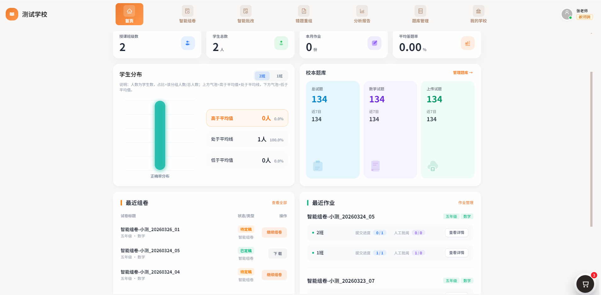</td>
        <td>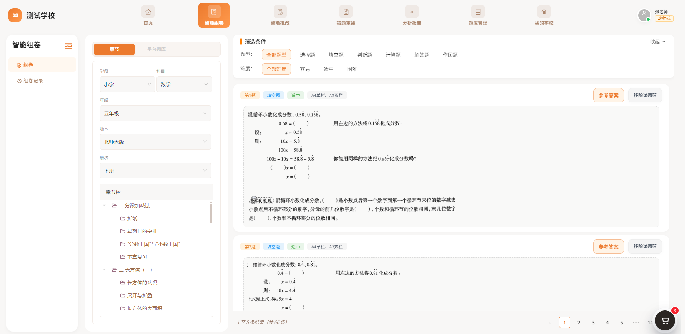</td>
    </tr>
    <tr>
        <td>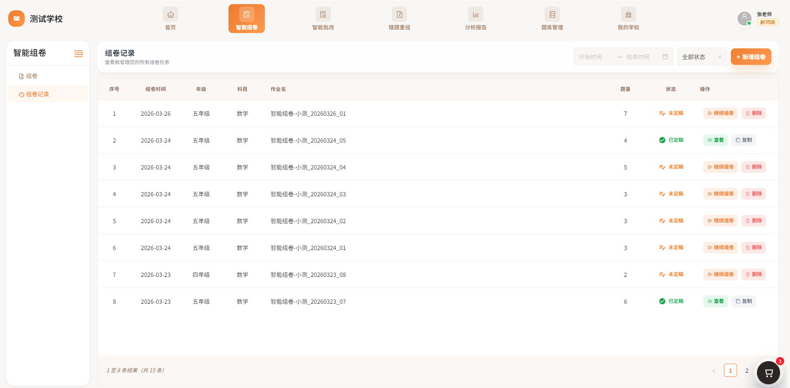</td>
        <td>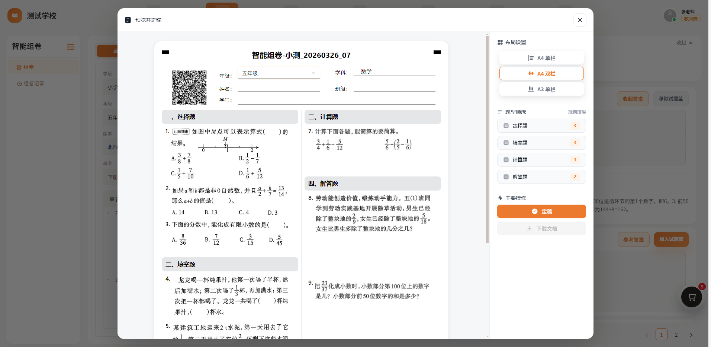</td>
    </tr>
    <tr>
        <td>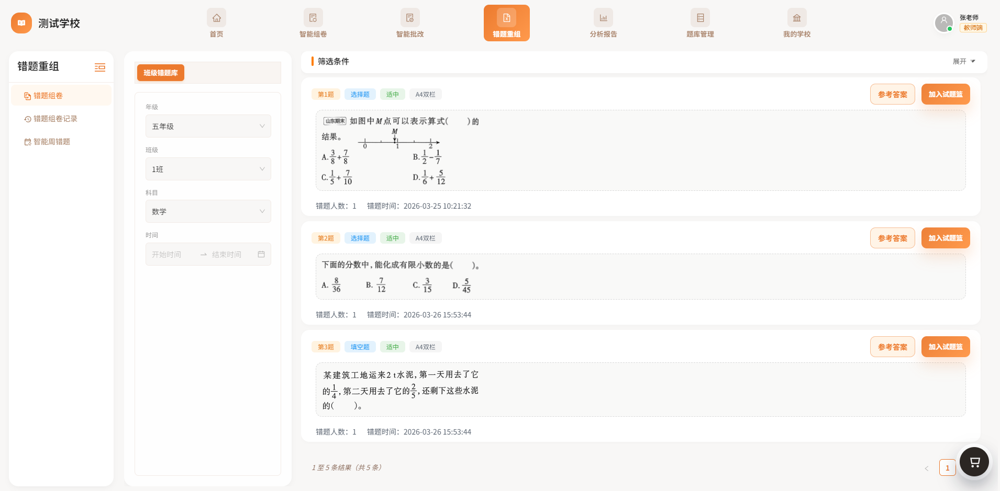</td>
        <td>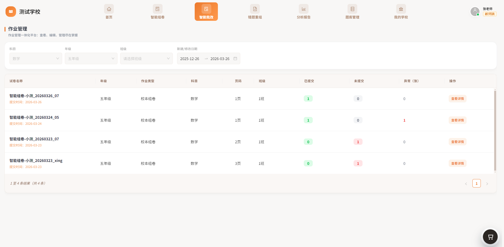</td>
    </tr>
	<tr>
        <td>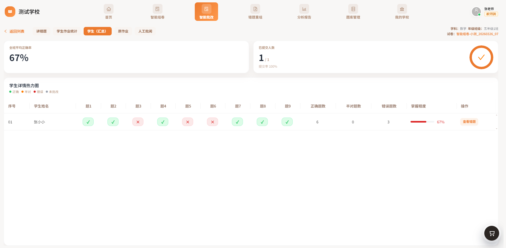</td>
        <td>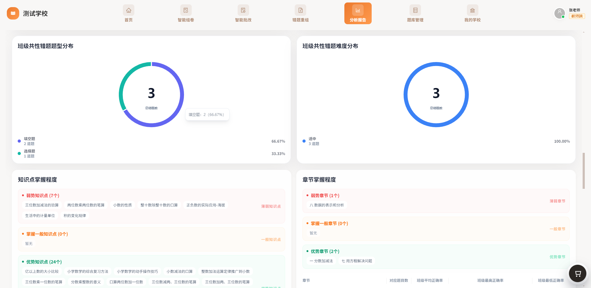</td>
    </tr>	 
    <tr>
        <td>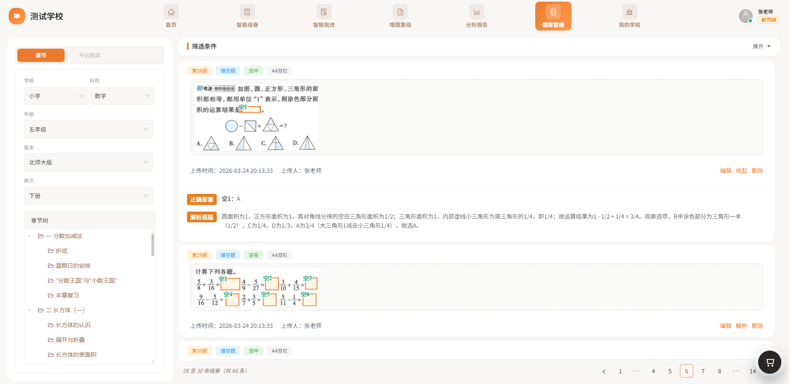</td>
        <td>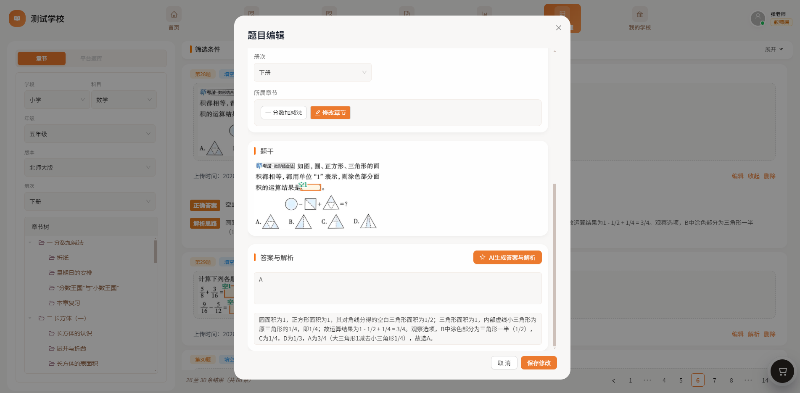</td>
    </tr>
	<tr>
        <td>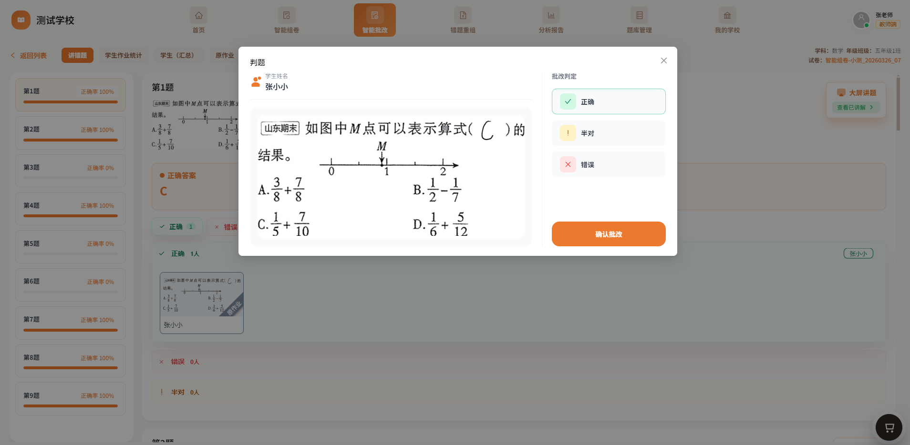</td>
        <td>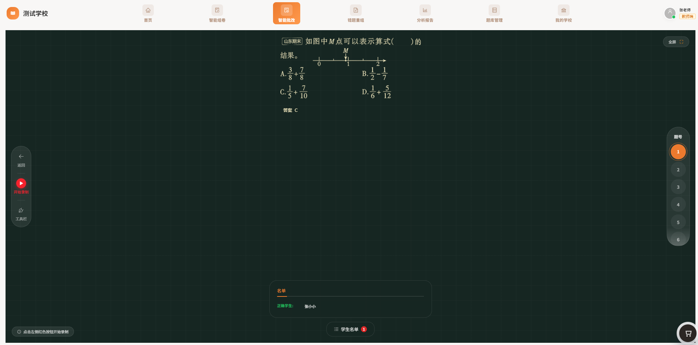</td>
    </tr>
    <tr>
        <td>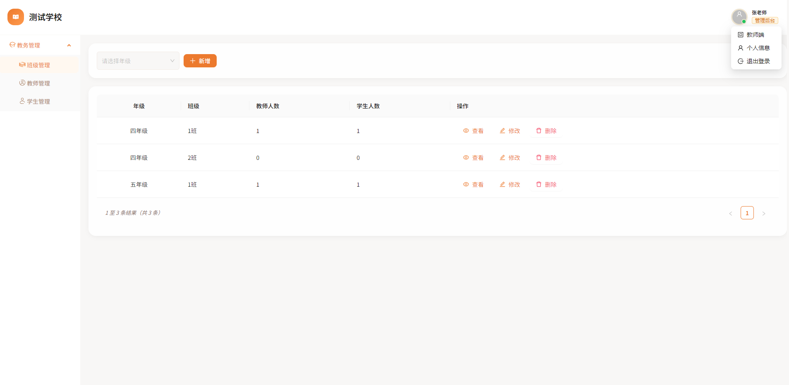</td>
        <td>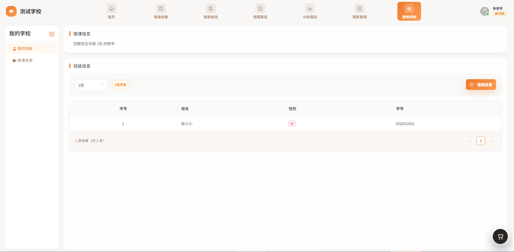</td>
    </tr>
    <tr>
        <td>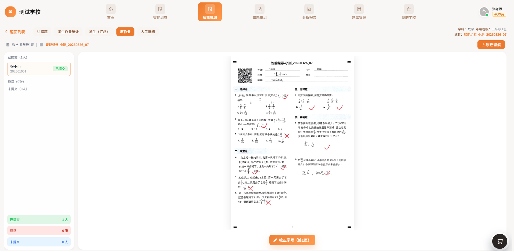</td>
    </tr>
</table>


## 切题系统演示
<table>
    <tr>
        <td>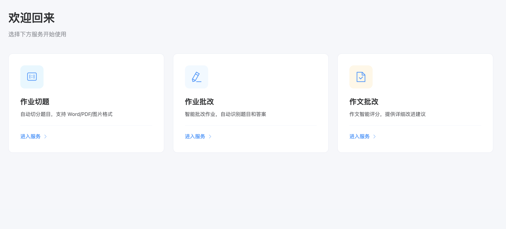</td>
    </tr>
    <tr>
        <td>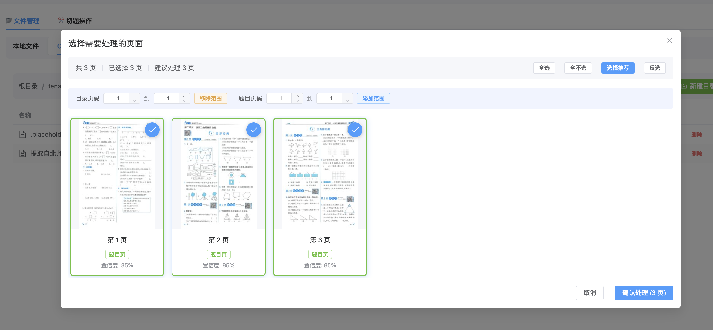</td>
    </tr>
    <tr>
        <td>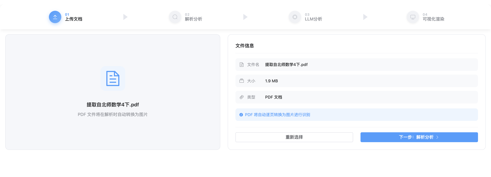</td>
    </tr>
    <tr>
        <td>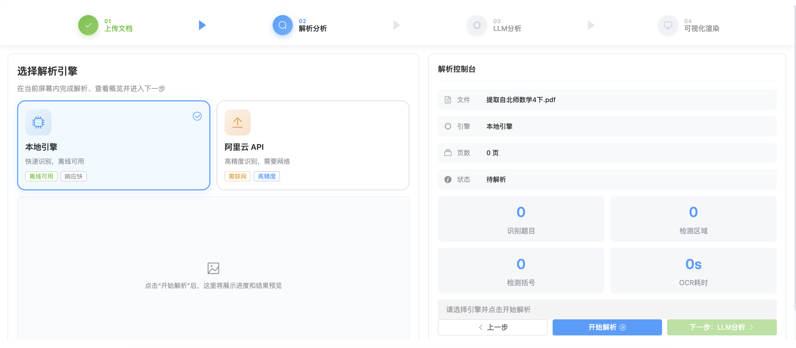</td>
    </tr>
    <tr>
        <td>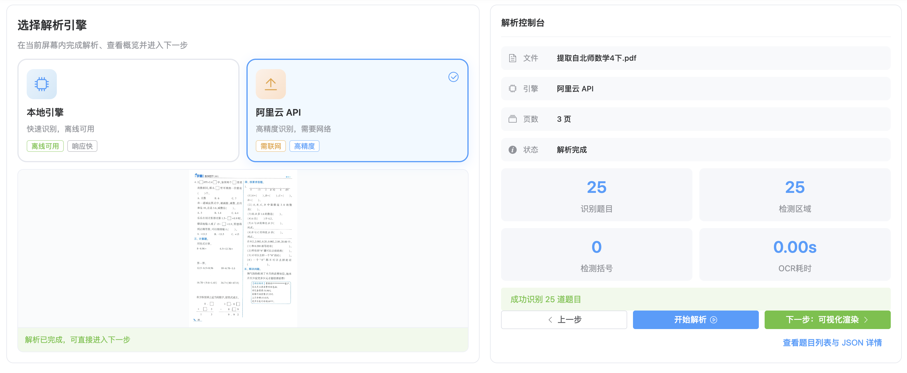</td>
    </tr>
    <tr>
        <td>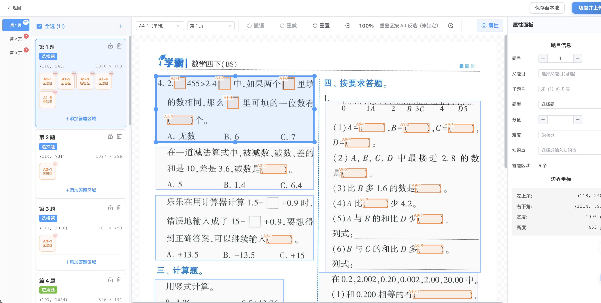</td>
    </tr>
</table>

## 交流学习

如有问题或建议，欢迎提交Issue或Pull Request。

QQ群：1092435967
