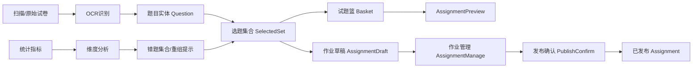

# 题库列表（QuestionBank）通路梳理与可视化

## 页面清单（关联项）
- 教师端
  - QuestionBankList.vue（题库列表）
  - QuestionEdit.vue（题目编辑）
  - QuestionNew.vue（题目新建）
  - ItemSelect.vue（选题面板）
  - ItemStats.vue（题目统计/分析）
  - AutoPaper.vue（自动组卷）
  - GenerateHomework.vue（生成巩固作业）
  - AssignmentManage.vue（作业/试卷管理）
  - AssignmentPreview.vue（作业预览）
  - PublishConfirm.vue（在线发布确认）
  - OCRScan.vue（OCR扫描录题）
  - ScanCollect.vue（扫描采集数据）
  - RecomposeErrors.vue（错题重组/改编）
- 教务端
  - affairs/QuestionSource.vue（题源与入库）
- 学生端（与题目选取/改编相关）
  - student/Mistakes.vue
  - student/MistakesDetail.vue
  - student/MistakesRecompose.vue

## 角色与入口概览
- 教师端：从“作业与批改”“课堂讲评”等一级菜单进入题库列表；也可能经由“生成巩固作业”“自动组卷”“选题面板”回到题库列表。
- 教务端：从“题源管理/资源发布”进入题库或题源页，再进行入库/校验。
- 学生端：错题本与重组改编链路可能引用或复用题库中的题目实体。

## 通路（Workflow）：教师端主流程
```mermaid
flowchart TD
  A[教师端一级菜单] --> B[QuestionBankList 题库列表]
  B --> C1{行内操作}
  C1 -->|加入作业| D[AssignmentManage 作业管理]
  C1 -->|加入试题篮| E[试题篮浮层]\n--> E2[AssignmentPreview 作业预览]\n--> E3[PublishConfirm 在线发布]
  C1 -->|编辑| F[QuestionEdit 题目编辑]
  C1 -->|复制为新题| G[QuestionNew 题目新建]
  C1 -->|预览| H[题目详情/预览视图]
  C1 -->|导入/批量编辑| I[导入/批量弹窗]\n--> B

  subgraph 选题与组卷
    J[ItemSelect 选题面板] --> K[GenerateHomework 生成巩固作业]\n--> D
    J --> L[AutoPaper 自动组卷]\n--> D
  end

  subgraph 扫描与OCR入库
    M[ScanCollect 扫描采集] --> N[OCRScan OCR录题] --> F
  end

  subgraph 错题与改编
    O[ItemStats 题目统计] --> P[RecomposeErrors 错题重组]\n--> J
  end
```

## 通路（Workflow）：教务端与学生端关联
```mermaid
flowchart LR
  QA[affairs/QuestionSource 题源页] --> QB[QuestionBankList] --> F[QuestionEdit]
  S1[student/Mistakes 错题本] --> S2[学生错题详情]\n(student/MistakesDetail) --> S3[student/MistakesRecompose]
  S3 --> J[ItemSelect] --> D[AssignmentManage]
```

## 数据通路（Dataflow）


- 题目实体（Question）：包含 `id/subject/grade/type/difficulty/status/score/...`
- 选题集合（SelectedSet）：由列表筛选/选题面板形成的题目ID集合
- 试题篮（Basket）：跨页面暂存选题集合（支持预览与分发）
- 作业草稿（AssignmentDraft）：用于预览、编辑、发布的中间态
- 已发布 Assignment：发布后的作业/试卷实体
- 统计与改编：统计生成的错题集合可用于重组与再次选题
- OCR/扫描：将原始试卷/图片转换为题目草稿，经编辑后入库为题目实体

## 页面级关联与入口/出口
- QuestionBankList
  - 入口：教师端菜单、选题面板回流、教务题源页跳转
  - 出口：加入作业、加入试题篮、编辑、复制新建、预览、导入/批量编辑
  - 关键数据：筛选条件、题目列表、选中项、批量项
- QuestionEdit / QuestionNew
  - 入口：题库列表的编辑/复制或 OCR 创建
  - 出口：保存后回到题库列表或继续选题
  - 关键数据：题目实体、校验规则
- ItemSelect / AutoPaper / GenerateHomework
  - 入口：题库列表或作业入口
  - 出口：生成作业草稿、进入作业管理/预览
  - 关键数据：选题规则、题目集合、目标班级/分层
- AssignmentManage / AssignmentPreview / PublishConfirm
  - 入口：加入作业、生成作业、试题篮预览
  - 出口：发布作业、返回题库/选题
  - 关键数据：草稿ID、班级/分层、发布参数
- OCRScan / ScanCollect
  - 入口：扫描采集或OCR入口
  - 出口：生成题目草稿并进入题目编辑或入库
  - 关键数据：识别文本/图片、题型结构
- ItemStats / RecomposeErrors
  - 入口：统计页或错题分析
  - 出口：重组生成选题集合并进入选题面板或作业生成
  - 关键数据：维度统计、错题集合
- affairs/QuestionSource
  - 入口：教务菜单
  - 出口：入库到题库列表或进入题目编辑
  - 关键数据：题源信息、入库审核状态
- student/Mistakes / MistakesDetail / MistakesRecompose
  - 入口：学生端错题功能
  - 出口：改编生成练习或反馈到教师端选题（跨角色场景）
  - 关键数据：学生错题集合、改编规则

## 路由与参数约定（建议）
- 从题库列表加入作业：`/teacher/assignment/manage?add=<questionId>` 或使用试题篮 `basket=true`
- 选题面板模式：`/teacher/item-select?mode=create|append&target=<classId|layerId>`
- 自动组卷：`/teacher/auto-paper?rule=<json>`
- OCR录题完成后返回：`/teacher/question/edit?id=<newQuestionId>` 或 `/teacher/question/new?draft=<draftId>`

## 备注
- 本文仅梳理通路，不涉及代码修改；后续你逐一核对后，我再按你的指示调整逻辑与跳转。
